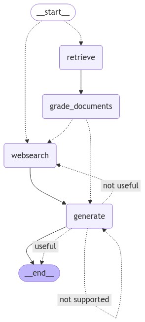

<h1 align="center">Advanced RAG Flow</h1>

<p align="center">
  
  
  
  
</p>

<p align="center">
  <a href="#dart-about">About</a> &#xa0; | &#xa0; 
  <a href="#sparkles-features">Features</a> &#xa0; | &#xa0;
  <a href="#rocket-technologies">Technologies</a> &#xa0; | &#xa0;
  <a href="#white_check_mark-requirements">Requirements</a> &#xa0; | &#xa0;
  <a href="#checkered_flag-starting">Starting</a> &#xa0; | &#xa0;
  <a href="#memo-license">License</a> &#xa0; | &#xa0;
  <a href="https://github.com/mariotoribi0" target="_blank">Author</a>
</p>

<br>

## :dart: About ##

**Advanced RAG Flow** is an adaptive and self-directed retrieval-augmented generation (RAG) framework, designed to enhance the precision and efficiency of intelligent agents. This system leverages **Adaptive RAG** (for contextualized query refinement) and **Self-RAG** (self-iterative query improvement), providing dynamic response quality across complex information retrieval tasks.




## :sparkles: Features ##

:heavy_check_mark: Adaptive and Self-RAG flows for enhanced response accuracy;\
:heavy_check_mark: Modular and scalable architecture supporting multiple agent types;\
:heavy_check_mark: Real-time, contextually aware interaction with agents;\
:heavy_check_mark: Optimized for complex, multi-stage retrieval tasks.

## :rocket: Technologies ##

This project uses the following tools and libraries:

- [LangGraph](https://langgraph.io/) - Graph-based NLP framework
- [LangChain](https://langchain.com/) - Framework for managing and chaining large language models
- [Python](https://www.python.org/) - Core programming language
- [Poetry](https://python-poetry.org/) - Dependency management and packaging

## :white_check_mark: Requirements ##

Before starting, ensure you have [Git](https://git-scm.com), [Python](https://www.python.org/), and [Poetry](https://python-poetry.org/) installed.

## :checkered_flag: Starting ##

```bash
# Clone this project
$ git clone https://github.com/mariotoribi0/advanced-rag-flow

# Access the project folder
$ cd advanced-rag-flow

# Install dependencies with Poetry
$ poetry install

# Activate the virtual environment
$ poetry shell

# Run the project
$ python agents/<MODEL>/main.py
```

## :memo: License ##

This project is under license from MIT. For more details, see the [LICENSE](LICENSE.md) file.


Made with :heart: by <a href="https://github.com/mariotoribi0" target="_blank">Mario Toribio</a>

&#xa0;

<a href="#top">Back to top</a>
